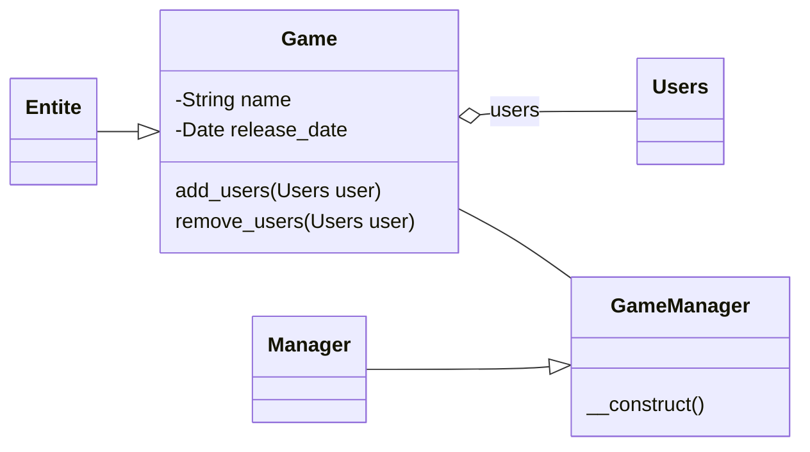

# tp-php-api

## Introduction 

Nous allons découvrir une base de code qui nous servira d'API (application programming interface). Le but sera de voir comment concevoir les bases et les exploiter. Il restera évidemment plein de points que nous n'aborderont pas ici tels que :

- Authentification
- Framework 
- Quotas
- Gateway
- ...

## Partie 1 : Installation & Exploration

Pour ce TP, nous allons partir d'une base de code existant. Vous pouvez le télécharger grâce à git.

```bash
git clone https://github.com/dept-info-iut-dijon/S3-PHP-TPAPI.git
```

Prenez le temps d'explorer le code et comprendre commence celui-ci fonctionne.

Pour déployer le code sur votre GRP :

1. Installez les tables via le fichier ./src/data/users.sql dans phpMyAdmin
2. Modifiez le fichier ./src/config/dev.ini avec vos infos de connexion bd
3. Envoyez les données sur votre FTP
4. Testez l'URL en modifant XXX et VOTRE-CHEMIN par vos infos relatives à l'arboresence de votre grp

```text
GET http://grp-XXX.iq.iut21.u-bourgogne.fr/VOTRE-CHEMIN/index.php?service=users
```

Pour visualiser le résultat, le navigateur peut suffir. Cependant, une fois que l'on voudra faire d'autres requêtes que GET, nous seront vite limité !

Pour cela, je vous invite à utiliser un client qui permet de parametrer vos requêtes HTTP :

- en CLI, il y a cURL.
- en extension VSC, il y a Thunder Client par exemple.
- dans PHPStorm, il y a dans tools/http client le moyen d'écrire des requêtes.
- en logiciel/app web, il y a Postman

Pour la suite du TP, je vous recommande Thunder client ou Postman qui vous permettra de créer une collection.

## Partie 2 : Collectionnez toutes ces URLs

Dans votre client REST, créez une collection que vous nommerez comme vous le souhaitez.

Ajoutez votre première requête ! Celle-ci aura pour but de récupérer tous les utilisateur. Donnez lui un nom qui explicite ce but.

L'URL est celle que vous avez testé plus haut ;). Etant une simple requête GET, celle-ci ne demande pas de paramètrage particulier !

### Create one User

Pour la suivante (entendez la Créer un nouvelle requête), nous allons voir pour créer un User ! Celle-ci aura donc besoin d'un peu plus d'informations. Les voici :

- Methode : POST (Au lieu de GET)
- URL fields
  - service : users
- Body : x-www-form-urlencoded (ou Form-encode)
- champs username
- champs email

Avec ceci, cela devrait créer un utilisateur ! (Relance votre requête GET, celle ci devrait afficher le nouvel User si vous la parametrez bien !)

Maintenant que tout fonctionne (enfin j'espère ^^) il nous manque encore quelques routes pour avoir notre CRUD standard.

### Read one or many User

Nous avions déjà une route qui retourne tous les utilisateurs, mais en avoir une qui n'en retourne qu'une partie basé sur un critère serait appréciable. (Moi je veux tous les Jean Claude !)

- Methode : GET
- URL fields
  - service : users
  - username (Optionnal)
  - email (Optionnal)

### Update one User

Nous allons mettre en place la route qui permet de mettre à jour un User. Les 2 champs du Body sont optionnels (en fonction de ce que l'on veut mettre à jour, donc n'hésitez pas à décocher si besoin)

- Methode : PUT
- URL fields
  - service : users
  - iduser : Un User ID
- Body : x-www-form-urlencoded (ou Form-encode)
- champs username (Optionnal)
- champs email (Optionnal)

### Delete one User

Et pour finir, nous allons supprimer notre utilisateur ! Petite info qui peut avoir son importance => Delete une ressource aura pour statut 204 que cette dernière existe au préalable ou non.

- Methode : DELETE
- URL fields
  - service : users
  - iduser : Un User ID

Nous avons maintenant une collection qui nous permet de manipuler des utilisateurs facilement. Imaginez à quel point cela facilite la communication avec vos collègues front-end !

Avec des outils comme Postman, on peut encore aller bien plus loin ! Ajouter une documentation, des tests et plus encore. Le domaine du développement d'API est encore vaste !

## Partie 2 : Agrandir notre API

Dans cette partie, notre objectif sera de rajouter un modèle CRUD pour une nouvelle entitée. Nous allons rester simple et utiliser un Game. Celui-ci sera défini comme tel :



Les Getters/Setters ont été omis ainsi que les infos liés à Entite, Manager et Users

Il nous faudra ensuite créer une table game dans notre base de donnée avec les informations relative à son entité.

L'agrégation se représentera sous une table user_game qui aura pour clé étrangères l'id d'un Game et l'id d'un User. Je vous recommande d'ajouter un id_user_game en tant que clé primaire.

Nous sommes prêts à avancer !

### Réussir à créer notre Game

Il est temps de répliquer ce que vous avez vu dans le code avec l'entité User, ceci étant très similaire (vous pouvez statuer que quand un Game est créé, aucun User n'y es associé).

Voici une liste d'étape pour vous guider !

1. Créer un GameController.php (Les fonctions seront similaires à UsersController)
2. Gérer le nouveau service dans index.php ($_GET['service'] == "game")
3. Gérer la méthode POST et utiliser notre GameController
4. Gérer les erreurs potentielles via des Exceptions
5. Retourner une réponse JSON

N'hésitez pas à demander de l'aide à votre enseignant si quelque chose vous semble obscure. Les lignes sont volontairement très générales, car c'est un process standard que vous verez avec le MVC plus en détail dans le S4.

Si tout va bien et que votre ressource est enfin créée en utilisant l'URL et votre outil de gestion API vu en partie 1... Et bien félicitation !

Toutes les routes du CRUD (Create Read Update Delete) ne devrait pas vous poser de soucis. Je vous invite au moins à faire la Read pour vous permettre de visionner vos Games !

## Partie Bonus : Lier un Users et un Game

Actuellement, le seul lien actif est une table vide, avec une liste vide en PHP. Il est temps de remédier à cela !

Plusieurs possibilités au niveau de l'URL. Actuellement, nous travaillons avec une variable service (qui peut prendre comme valeur "users" ou bien "game").

Nous pouvons ajouter un troisième choix : "users_game", ce qui serait simple et ne change pas notre structure de communication.

Nous pouvons aussi ajouter une nouvelle variable du genre ss_service="users". Cela correspondrait aux Users pour un Game donné (et donc avec aussi un champ id_game).

Vous êtes libre de votre choix de conception. L'objectif est que dans votre index.php, vous savez que vous voulez ajouter (ou supprimer) l'id_user 5 a l'id_game 3 par exemple ! 

Ensuite, vous avez carte blanche pour gérer la liste de Users dans votre Game ! Bon courage soldat ! 

## Conclusion

Nous avons introduit la notion d'API dans ce TP, cela pourra vous servir comme point de départ pour évoluer dans ce domaine. Aujourd'hui, le CRUD est une tâche standard qui est simplifiée par de nombreux framework.